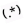

##  Regex tips 

### Operators precedence
`^foo|bar$` won't just match strings `foo` and `bar`, but also e.g. `foo_123` and `rabarbar` 

In fact, the (simplified) precedence of operators in regexes is, from strongest to weakest:
1. Duplication: `a*`, `b+`, `c?`
2. Concatenation i.e. plain "neighbourhood": `ab`, `c$`, `^def`
3. Alternative: `a|b`

`^foo|bar$` means `("foo" at the start) OR ("bar" at the end)`  <br/>
Use `^(foo|bar)$` instead 

### Lookbehind/lookahead
Most regex engines allow you to specify that the given string **must/must not** be **preceded/followed by** another string... this relatively unknown feature is called *positive/negative lookbehind/lookahead* (collectively: *lookarounds*):
* `(?<=foo|bar)qux` will only capture `qux` occurrences preceded by `foo` or `bar` (positive lookbehind)
* `(?<!foo|bar)qux` will only capture `qux` occurrences NOT preceded by `foo` or `bar` (negative lookbehind)
* `qux(?=foo|bar)` will only capture `qux` occurrences followed by `foo` or `bar` (positive lookahead)
* `qux(?!foo|bar)` will only capture `qux` occurrences NOT followed by `foo` or `bar` (negative lookahead)

This is supported by default by Java/Kotlin/Scala, Python, JS (lookahead only); in `git grep`/GNU `grep`, you need to pass `turbo mode` aka `-P`/`--perl-regexp` flag

In `grep`, this is esp. useful in combination with `-o` (aka `--only-matching`, prints only the part matching the regex, not the whole matched line):
```
grep -Po "(?<=version = ')[0-9]+\.[0-9]+\.[0-9]+"
```

On `version = '1.2.3'` input, it'll simply print the matched part (`1.2.3`); lookarounds only tell about the context but aren't part of the matched string itself.
